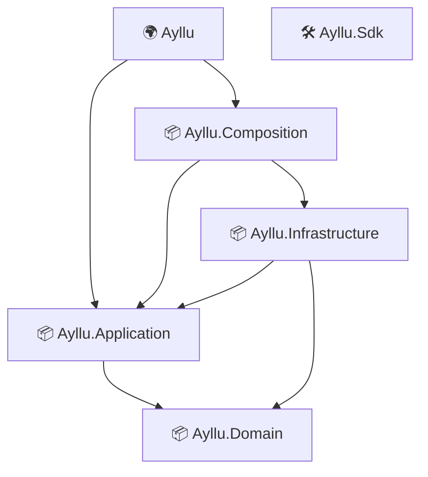

# AI implementation instructions

- Atue como um Engenheiro de software Senior .NET 10.0.
- Mantenha o padrão de um projeto por camada (Aplicação, Dominio ou Infraestrutura) em ambos projetos de client/server.
- O unico projeto que não segue esse concern é o projeto `Ayllu.Sdk`.

## Arquitetura



## Fluxo de dados

```text
___________________________________________________________________________________________________________________________________
|   CLIENT                                                                                                                         | 
|   ________________________                        _________________________                       _______________________        |
|   |        (MAUI)         |                      |      Application       |                      |    Infrastructure     |       |
|   |     Presentation      |                      |                        |                      |     ______________    |       |
|   |    ________________   |     Mediator.NET     |    _______________     |    Abstract          |    |   Services   |   |       |
|   |    |    Views     |   | Commands & Requests  |    |   Handlers   |    |  Feature Service     |    |______________|   |       |
|   |    ⌊______________⌋    |---------------------→|    ⌊______________⌋     |                     |     ____↑____↓____     |      |
|   |     ___↓_____↑____    |                      |    ____↓___↑______     |---------------------→|    |  Ayllu.SDK   |   |       |
|   |    |  View Models |   |                      |    |  Pipeline    |    |                      |    |  (REST API)  |   |       |
|   |    ⌊______________⌋    |                      |    |  Middlewares |    |                      |    ⌊______________⌋    |      |
|   |                       |                      |     ⌊______________⌋    |←---------------------|                       |       |
|   ⌊________________________⌋                      ⌊________________________⌋     Http responses    ⌊_______________________⌋      |
|                                                                                                                                   |
|                                                                                                                                   |
|___________________________________________________________________________________________________________________________________|

___________________________________________________________________________________________________________________________________
|   SERVER                                                                                                                         | 
|    _______________________                       _________________________                       _______________________         |
|   |   Presentation        |                      |      Application       |                      |                       |       | 
|   |                       |                      |                        |                      |    Infrastructure     |       |
|   |  _________________    |     MediatR          |     _______________    |    Application       |     ______________    |       |
|   |  | TRequest       |   | Commands & Queries   |    |   Handlers   |    |  Feature Service     |    |   Services  |    |       |
|   |  | ↪ Controllers |    |    From Requests     |    ⌊______________⌋    |    Abstraction       |   |_____________|     |      |
|   |  | ↪ Razor Pages |    |---------------------→|         |  ↑           |---------------------→|     ___↑___↓______    |      |
|   |  ⌊________________⌋    |                      |    _____↓__|____       |                      |    |   Repository |   |      |
|   |       ____↓____       |                      |    |  Behaviors |      |                      |    ⌊______________⌋    |      |
|   |      |TResponse|      |                      |    ⌊_____________⌋      |←---------------------|    _____↑___↓_____    |      |
|   |      ⌊__________⌋      |←---------------------|                        |     Entity Results   |    |Unit of Work  |   |      |
|   ⌊________________________⌋ Commands & Queries   ⌊________________________⌋     Model Mapped      |    ⌊______________⌋    |     |
|         _____↓_______       Results -> TResponse                                                  ⌊_______________________⌋      |
|        | OPENAPI     |                                                                                                           |
|________⌊_____SPEC_____⌋___________________________________________________________________________________________________________|


______________________________________________________________________________
|   SERVER + CLIENT                                                           | 
|    _______________________                 _______________________          |
|   |   SERVER             |                |      AYLLU.SDK       |          |
|   |                      |     Kiota      |    _______________   |          |          
|   |  _________________   |---------------→|    |   SERVER     |  |          |
|   |  | OpenAPI.json   |  |                |    |   REST HTTP  |  |          |
|   |  ⌊________________⌋   |                |    |   CLIENT     |  |          |
|   ⌊_______________________⌋                |    ⌊______________⌋   |          |
|                ↖                          ⌊_______________________⌋         |  
|                  \                       ↗                                  | 
⌊                   \_____________________/                                   |                 
|                    |                    |                                   |
|                    |   CLIENT           |                                   |
|                    |____________________|                                   |
|                    |                    |                                   |
|                    |  + Rest Services   |                                   |
|                    |    (Ayllu.SDK)     |                                   |
|                    ⌊_____________________⌋                                   | 
|                                                                             |
|_____________________________________________________________________________|


```

## Fluxo de exceção

Todo o fluxo de dados iniciado com uma request em Presentation (via razor ou controller) deve estar envolto em instruções `try/catch/finally` para fins de logging/limpeza. Catches devem inserir log de erro e relançar a exceção original. Exceções propagam até o Exception Handler Global.

O exception handler global traduz erros de validação, autorização, não-encontrado, conflito, persistencia ee falhas não esperadas para o pattern RFC `Problem Details` incluindo códigos HTTP apropriados.

## Escrita e Formatação

- Preferir file-scoped namespaces.
- Uma diretiva razor por linha.
- Uma atribuição de váriavel por linha, exceto quando em atribuição 'tuplada'.
- Não utilizar implmentações stubs ou TODO, bem como também não usar `throw new NotImplementedException()`
- Usar construtores primários sempre que possível.


## Documentação

Toda implementação publica requer documentação completa em en-US usando documentação XML.
